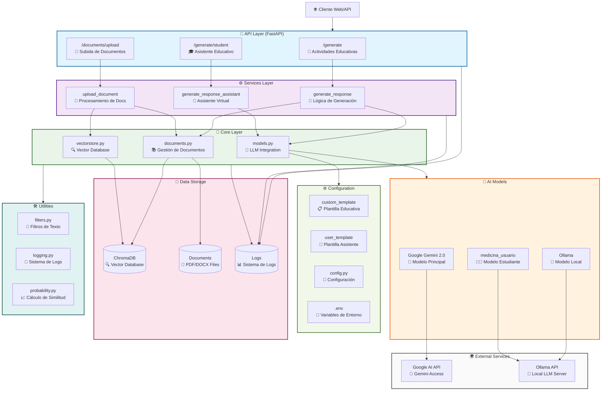
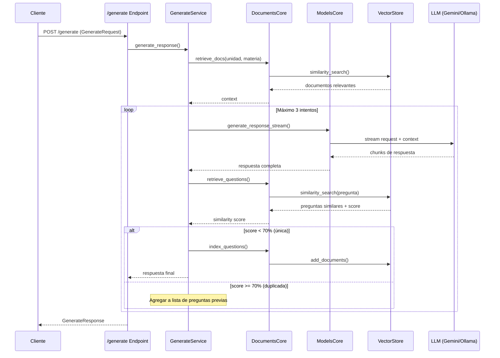
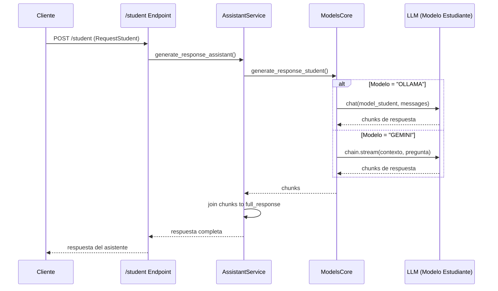
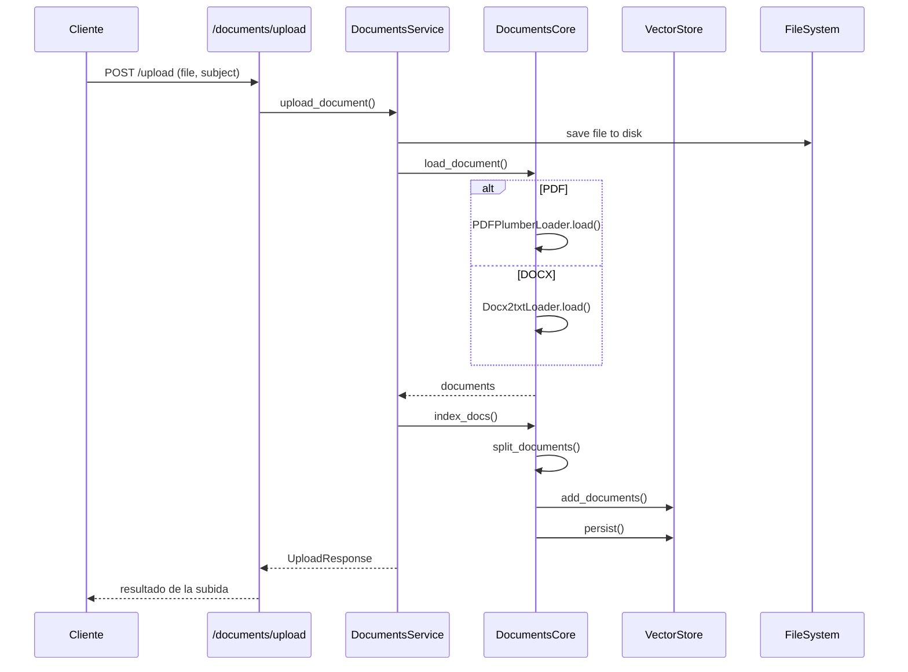
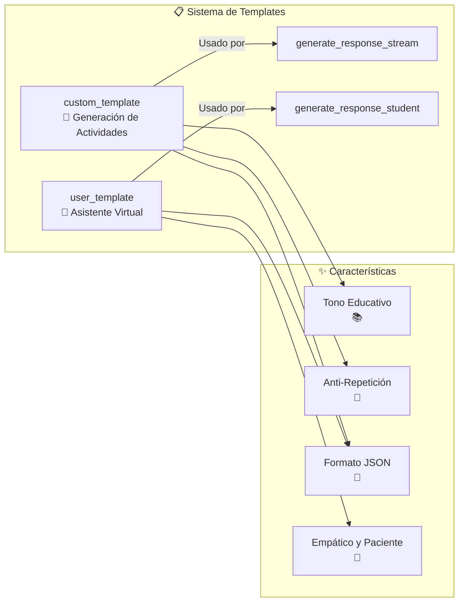
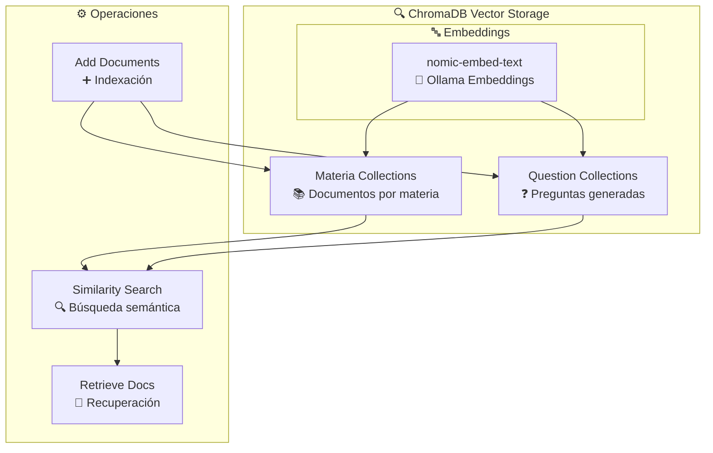
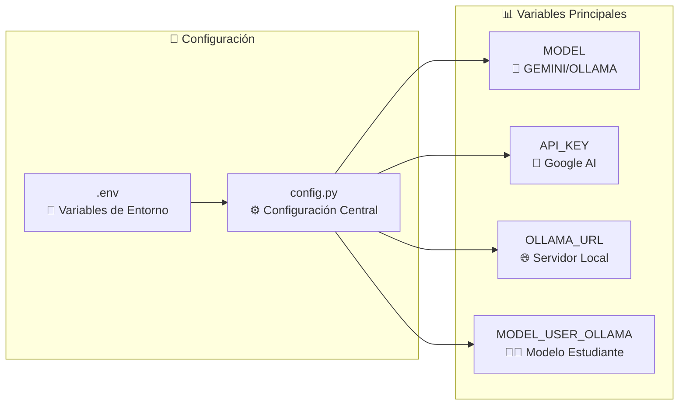

# Arquitectura del Sistema RAG - Gemini/Ollama

## Diagrama de Arquitectura General

## Flujo de Datos Detallado

### 1. Generación de Actividades Educativas

### 2. Asistente Virtual para Estudiantes

### 3. Subida y Procesamiento de Documentos

## Componentes Clave

### Templates de Prompts

### Sistema de Vector Database

### Configuración y Variables de Entorno

## Patrones Arquitectónicos Implementados

1. **🏗️ Layered Architecture**: API → Services → Core → Storage
2. **🔄 Repository Pattern**: Abstracción de acceso a datos
3. **🎯 Strategy Pattern**: Intercambio entre Gemini y Ollama
4. **📋 Template Method**: Reutilización de lógica de generación
5. **🔍 RAG (Retrieval-Augmented Generation)**: Enriquecimiento contextual
6. **📊 Logging Pattern**: Trazabilidad completa de operaciones
7. **⚡ Streaming Pattern**: Respuestas en tiempo real

## Tecnologías Utilizadas

- **🚀 FastAPI**: Framework web asíncrono
- **🦜 LangChain**: Orquestación de LLMs
- **🔍 ChromaDB**: Base de datos vectorial
- **🌟 Google Gemini 2.0**: Modelo de IA principal
- **🦙 Ollama**: Servidor de modelos locales
- **📄 PDFPlumber/Docx2txt**: Procesamiento de documentos
- **🔤 Nomic Embed**: Embeddings de texto
- **📝 Pydantic**: Validación de datos
- **📊 Python Logging**: Sistema de logs
